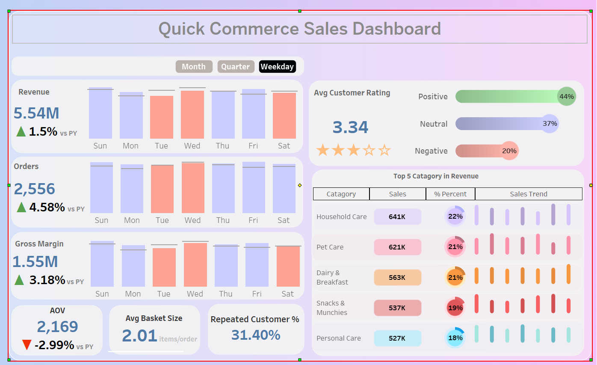

# Blinkit Sales Dashboard  

This project presents an interactive dashboard for **Blinkit (Quick Commerce)** sales and delivery performance.  
The data was processed using SQL and visualized in **Tableau Public** to uncover insights into orders, customers, and delivery efficiency.  

---

## 🔎 Key Insights  
- **Sales Trends** – track order volumes and revenue over time  
- **Category Performance** – identify top-selling product categories  
- **Customer Segmentation** – analyze behavior across different customer types  
- **Delivery Analysis** – measure delays, distance, and reasons for late deliveries  
- **Customer Feedback** – explore ratings, feedback categories, and sentiment  

---

## 📊 Dashboard Link  
👉 [View the Dashboard on Tableau Public](https://public.tableau.com/app/profile/abhinandan.nath/viz/QuickCommerceSalesDashboard_17555321579360/Dashboard1?publish=yes)  

---

## 🖼️ Preview  
  

*(Add a screenshot of your dashboard in the `images/` folder with the name `dashboard.png` so it appears here.)*  

---

## 🚀 Next Steps  
- Add profitability KPIs (margins vs sales)  
- Build interactive filters for deeper drilldowns  
- Expand dashboards for customer retention and cohort analysis  
- Automate SQL → Tableau integration with live data  

---

## 📂 Repository Structure  
blinkit-dashboard
├── images
│   └── dashboard.png
└── README.md